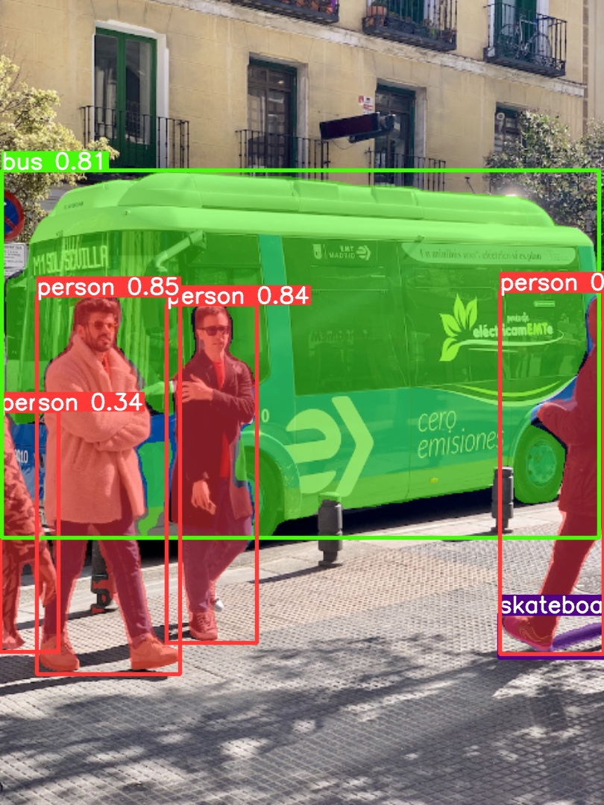

# 全新的tensorrt封装，轻易继承各类任务
- 轻易实现各类任务的生产者消费者模型，并进行高性能推理
- 没有复杂的封装，彻底解开耦合!

# 关于Yolo-Demo
- 目前支持Yolo系列3/4/5/x/7/8
- 支持了YoloV8-Segment


# 说明
- cpm.hpp 生产者消费者模型
    - 对于直接推理的任务，通过cpm.hpp可以变为自动多batch的生产者消费者模型
- infer.hpp 对tensorRT的重新封装。接口简单
- yolo.hpp 对于yolo任务的封装。基于 infer.hpp

# trt的推理流程
### step1 编译模型，例如
`trtexec --onnx=yolov5s.onnx --saveEngine=yolov5s.engine`

### step2 使用infer推理
```
model = trt::load("yolov5s.engine");
... preprocess ...

// Configure the dynamic batch size.
auto dims = model->static_dims();
dims[0]   = batch;
model->set_run_dims(dims);
model->forward({input_device, output_device}, stream);

... postprocess ...
```
# CPM的使用(将推理封装为生产者消费者)
```
cpm::Instance<yolo::BoxArray, yolo::Image, yolo::Infer> cpmi;
cpmi.start([]{
    return yolo::load("yolov5s.engine", yolo::Type::V5);
}, batch);

auto result_futures = cpmi.commits(images);
for(auto& fut : result_futures){
    auto objs = fut.get();
    ... process ...
}
```